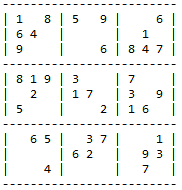
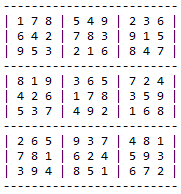
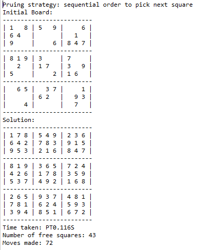

# Sudoku
This is a Java implementation of solving Sudoku puzzles based on Skiena's backtracking algorithm as described in his book "The Algorithm Design Manual".

## First thing first, what is Sudoku?
[Sudoku](https://en.wikipedia.org/wiki/Sudoku) is a puzzle game whose objective is to fill in a 9x9 grid of squares with numbers 1 to 9.  In each row, column, or box (3x3 grid of squares within the grid), there should not be any repeating numbers.  

Note: 'box' is what Skiena called 'sector' in his book.  I use 'box' to be more aligned to what is generally accepted term in Sudoku games.

Example puzzle:

Solution:

## Pruning Strategies
Tow different type of pruning strategies are implemented, selecting next square to fill and suggesting candidates for filling.

### Next Square
1. Sequential - pick the next free square.  This is most simplest and straight forward strategy
1. Most constrained - pick the next free square with fewest candidate numbers available.

### Candidate Suggestion
1. Local count - find candidates from a square after removing values already placed in its row, column or boxes.
1. Look ahead - find candidates who would not block other free squares in its row, column or sector.

## Source Code Structures
### Packages
algo - Basic algorithm for backtrack.

game - Solution for solving Sudoku game.

### Example
Run main class 'SudokuCommand'.

Output of 'SudokuCommand':

